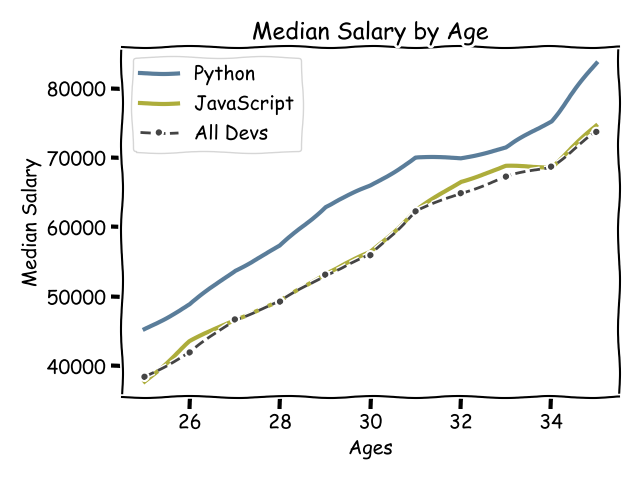
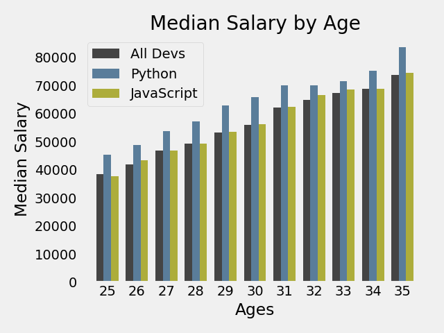
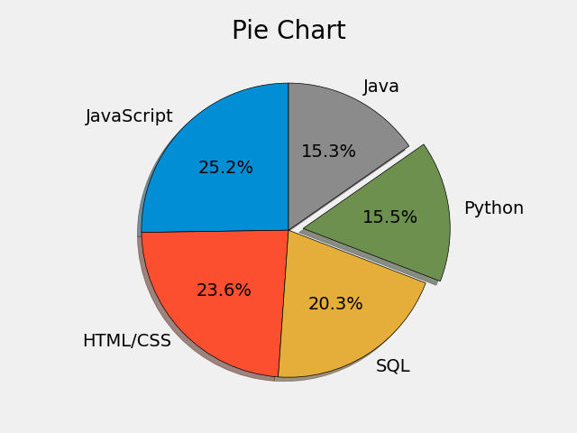
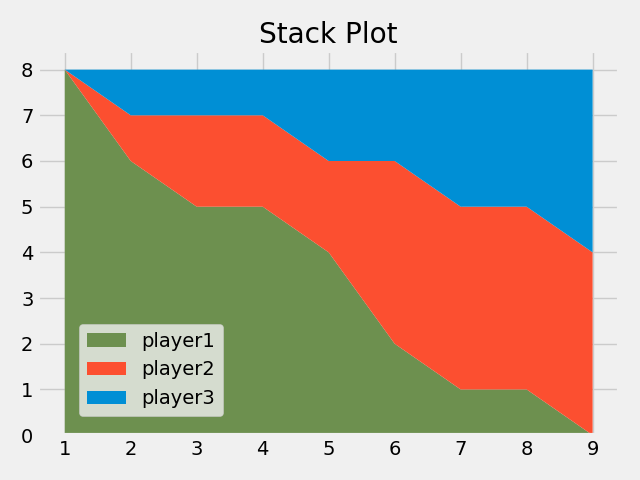
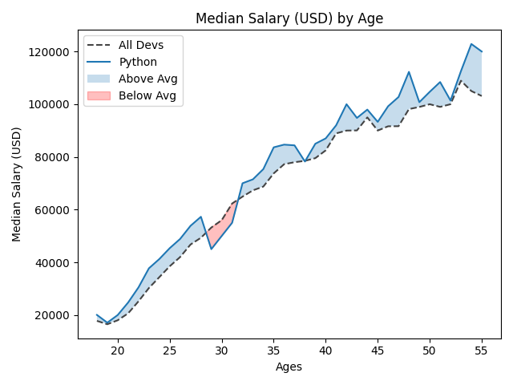
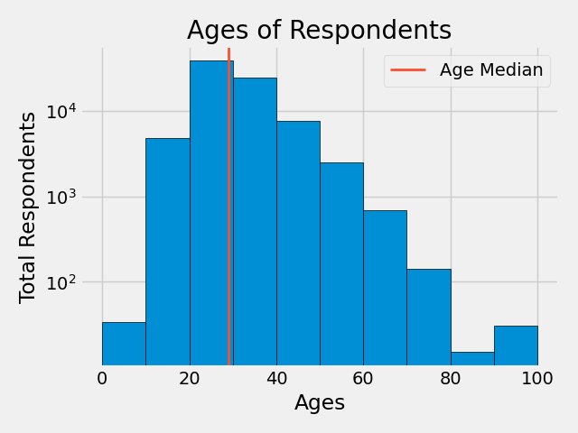
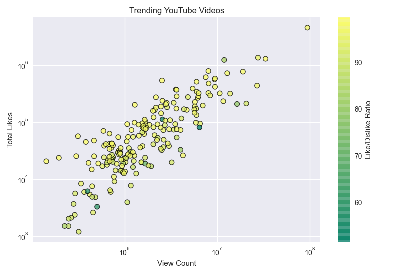
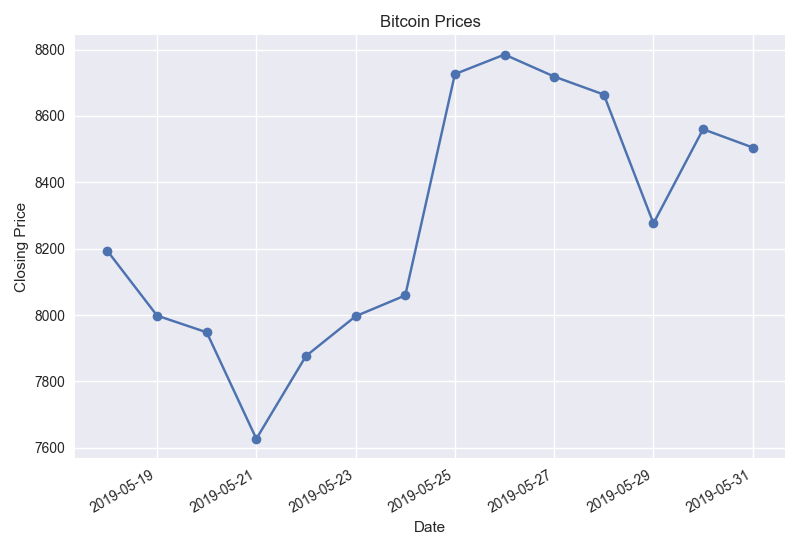
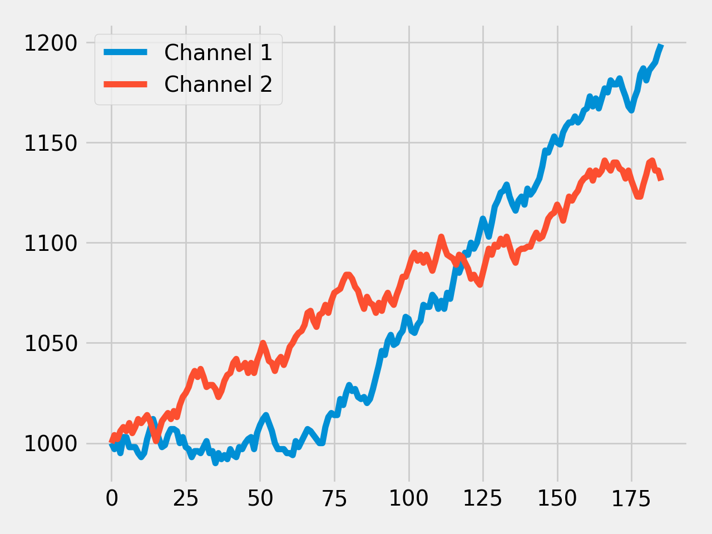

# tryMatplotlib

- [Matplotlib Tutorials by Corey Schafer](https://www.youtube.com/playlist?list=PL-osiE80TeTvipOqomVEeZ1HRrcEvtZB_)
  - [code snippets](./CoreySchafer/)
  
    
    
    
    
    
    
    
    
    